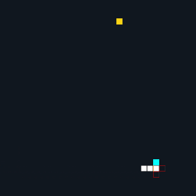

# Snake AI - A* search algorithm
The project applies the `A* search algorithm` to solve the shortest path problem in the **Snake game**.
## Demo
 
## Dependencies 
* SDL2 >= 2.0
  * All installation instructions can be found [here](https://wiki.libsdl.org/Installation)
  * Note that for Linux, an `apt` or `apt-get` installation is preferred to building from source.
* gcc/g++ >= 5.4
  * Linux: gcc / g++ is installed by default on most Linux distros
  * Mac: same deal as make - [install Xcode command line tools](https://developer.apple.com/xcode/features/)
  * Windows: recommend using [MinGW](http://www.mingw.org/)
## Build Instructions
  - Creating a `snake` project in visual studio 
  - Installing SDL2 
  - Copying all files in `scr` into the project.
